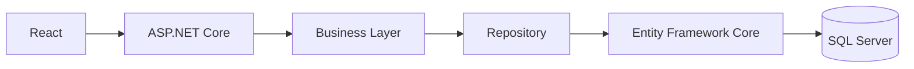

# Botta Rohit Yadav

<h1 align="center">Full Stack .NET Developer • AI Engineer</h1>

> Built from resume details.

## About
- .NET 8 / ASP.NET Core
- C#, React, TypeScript
- Entity Framework Core
- REST APIs
- JWT & RBAC
- Python Automation
- Java / Spring Boot
- AWS Cloud Foundations

## Featured Projects

### Employee Management System
- .NET 8 Web API
- EF Core
- JWT Authentication
- RBAC
- GitHub Actions
- Swagger

### AI Resume Review Assistant
- React
- TypeScript
- GraphQL
- ASP.NET Core

### IT Incident Auto-Triage
- Python
- ServiceNow
- Jira
- Azure Boards

## Tech Stack


## GitHub Stats
Replace USERNAME below with **rohityadavbotta5-sudo**

```md
https://github-readme-stats.vercel.app/api?username=USERNAME&show_icons=true&theme=tokyonight
https://github-readme-streak-stats.herokuapp.com/?user=USERNAME&theme=tokyonight
```

## Architecture


